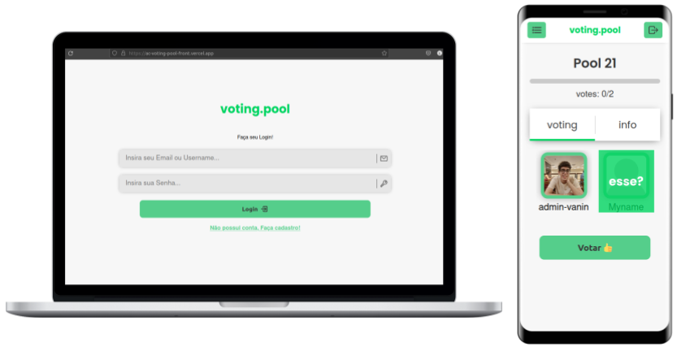
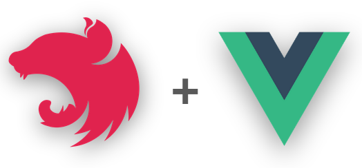

<p align="center" >


</p>

<h1 align="center">
voting.pool
</h1>

Voting.pool é um app de votação 🗳️ com o front e o back sendo desenvoldido com ferramentas da linguagem JavaScript. Para ver o código do [backend](https://github.com/LuigiVanin/ac-voting.pool-back) e [frontend](https://github.com/LuigiVanin/ac-voting.pool-front) você pode acessar seus repos separados ou entrar nas pastas de `/server` e `/web`.

Esse repo é um monorepo dos outros dois repos citados. O projeto em questão teve seu deploy feito na aws(EC2) usando NGINX e Docker.

Algumas das funções do app:

-   O app deve ser capaz de criar novos usuários.
-   usuários podem logar e permanecer logados até efetivarem log out.
-   Todo usuário pode criar **pool** e adicionar qualquer pessoa na **pool**, sendo o dono automaticamente adicionado.
-   Todos os integrantes da **pool** podem votar entre si, porém não em si mesmo.
-   Participantes de uma **pool** podem visualizar os resultados da **pool** após ela ser fechada
-   Somente o dono da **pool** pode fechar a mesma.

<h3 align="center">

<a  href="http://ec2-18-231-116-229.sa-east-1.compute.amazonaws.com"/>

«Acessar Demostração»

</a>

</h3>

<h2>
Preview 👓
</h2>

<p align="center" >



## Como Rodar 🚀

Para rodar o projeto localmente é necessário rodar tanto o front quanto o back, então é necessário baixar ambos os repositórios na sua máquina ou baixar o monorepo - para isso use **git clone** ou baixe manualmente.

```bash
> git clone https://github.com/LuigiVanin/voting.pool-monorepo.git
```

Antes de mais nada, é importante lembrar-se que esse projeto necessita do uso de um banco de dados postgres. Por isso, antes mesmo de iniciar o backend é preciso realizar a configuração deste. Após ter feito isto, basta executar as devidas configurações Após setar seu banco postgres, basta configurar o projeto - para isso basta seguir o exemplo de .env, o arquivo `.env.example`.

### 1. Como rodar o Backend

Para rodar o front basta entrar na pasta do mesmo e instalar as dependências:

```bash
> npm i
```

Agora, precisamos setar o banco de dados:

```bash
npx prisma migrate dev
```

Para rodar em desenvolvimento basta usar o seguinte script:

```bash
npm run start:dev
```

### 2. Como rodar o Frontend

Para rodar o front basta entrar na pasta do mesmo e instalar as dependências:

```bash
> npm i
```

Agora, para rodar a versão de desenvolvimento rodamos o seguinte script:

```bash
> npm run dev
```

### 3. Como rodar ambos usando Docker 🐋

Na raiz do projeto rode:

```
> docker-compose -f docker-compose.test.yml up --build
```

Isso irá rodar a aplicação na sua porta 3000!

**OBS.:** Vale salientar que tanto o back quanto o front tem suas aplicações dockerizadas, então é possível roda-las separadamente. O arquivo `docker-compose.test.yml` já dockeriza ambas aplicações e as junta em um porta usando nginx.
<br />

## Como Testar 🧪

Os testes desses repo utilizam das libs do Jest(back) e Cypress(front) - para rodar os respectivos testes basta rodar os scripts corretos!

**No backend** é necessário utilizar o docker para subir o banco de testes e rodar o script:

```bash
npm run test:e2e
```

ou, usando docker compose da pasta `server/`(lembre de setar env file `.env.prod`):

```bash
> docker-compose -f docker-compose.ci.yml up --build --exit-code-from node_app
```

**No frontend**

WIP 🚧🚧🚧

## Features futuras

Essas features serão desenvolvidas conforme o dev(eu) estiver com tempo livre...

-   [x] Adicionar um ReadMe
-   [x] Adicionar compatibilidade com docekr
-   [x] Criar um monorepo
-   [x] Mudar restante das notificações para toasts
-   [x] Corrigir bug da tela de resultado.
-   [ ] Habilitar CI
-   [ ] Finalizar testes de backend.
-   [ ] Finalizar testes de Frontend
-   [x] Migrar toda a aplicação para aws EC2.

---

## Ferramentas Utilizadas 🛠️

<h1 align="center" >



</h1>

<p align="center">
    
    
    
    
    
    
    
    
    
    
    
    
    
</p>

## Outras Ferramentas 📦

-   [Axios](https://axios-http.com/).
-   [Chalk](https://www.npmjs.com/package/chalk).
-   [Joi](https://joi.dev/).
-   [pactum](https://pactumjs.github.io/).
-   [Pinia](https://pinia.vuejs.org/)
-   [Vue-Router](https://router.vuejs.org/)

_-> Mais pacotes podem ser vistos nos package.json de cada repo._

## Entre em contato 📞

<br>

<p align="center">
<a href="https://www.linkedin.com/in/luis-felipe-vanin-martins-5a5b38215">

</a>
<a href="mailto:luisfvanin2@gmail.com">

</a>
</p>
